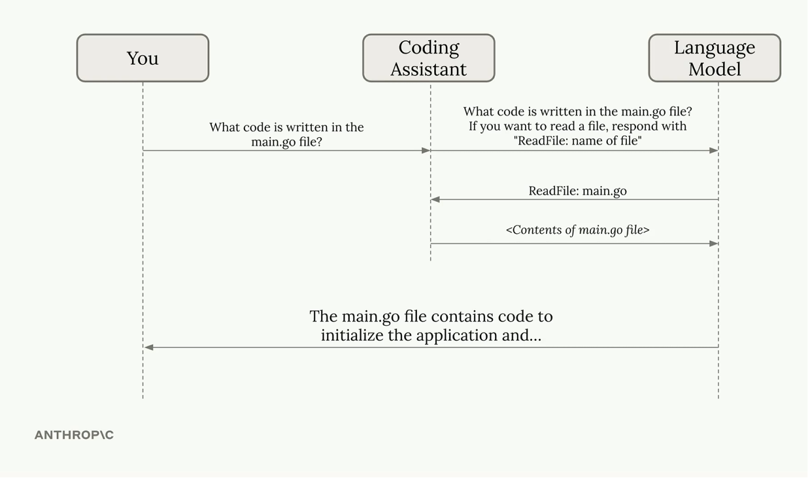
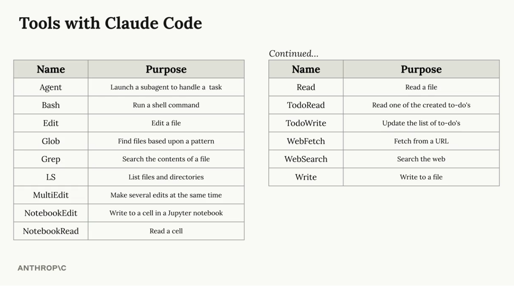
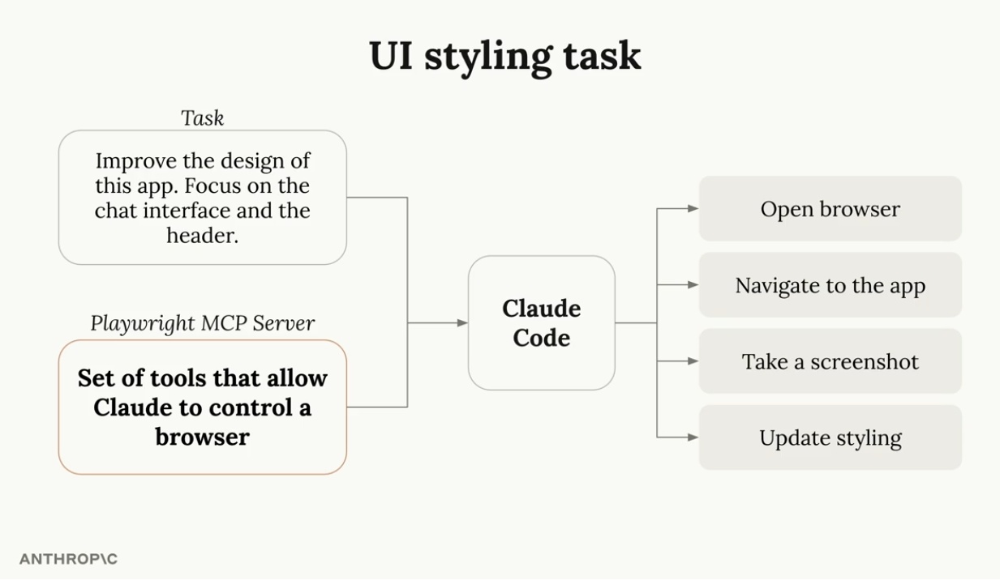
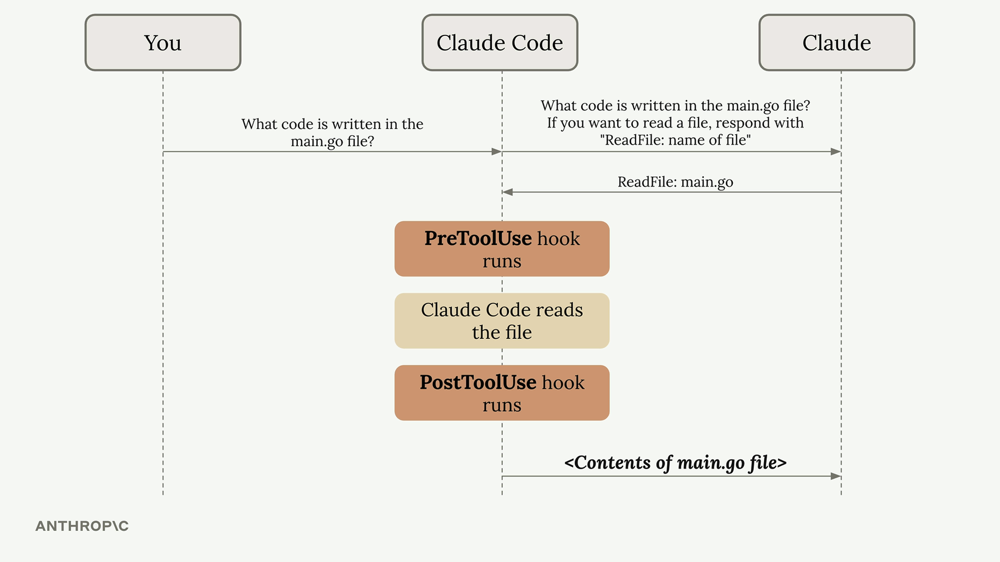
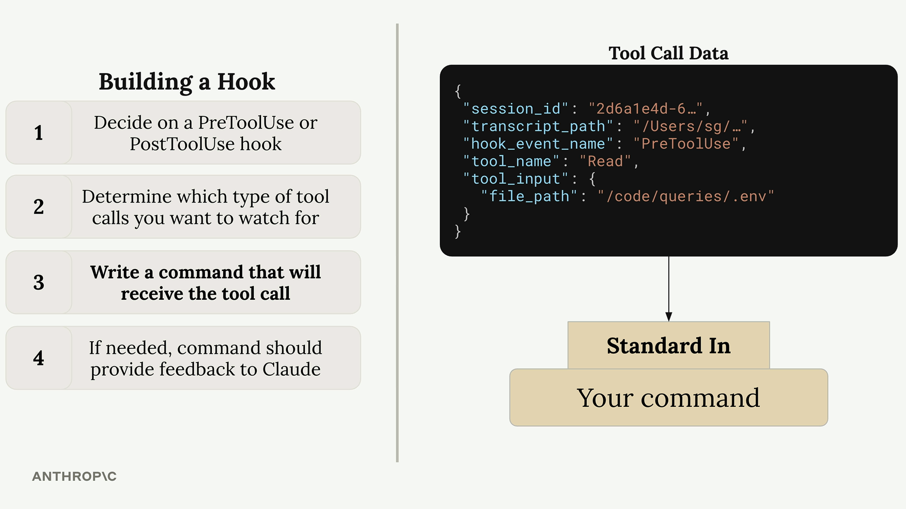

# 🎬 Claude Code in Action

Notes, key takeaways, and snippets from the **Anthropic - Claude Code in Action** course.

- **Course Link:** [Anthropic Course Platform](https://anthropic.skilljar.com/claude-code-in-action)
- **Status:** Completed ✅

---

## 💡 Key Insights & Takeaways

### 1. What is a Coding Agent?


Simply put, a coding agent is an LLM that performs tool calls to acquire context and execute actions to fulfill user goals.

> [!IMPORTANT]
> Claude Code does **not** pre-index your codebase (unlike Cursor). It relies entirely on its active tool use to explore and inspect files, which significantly improves security.

#### Claude's Default Tools:


#### UI (Playwright) Tool:


### #snippet: Add Playwright MCP
Add the Playwright MCP server to Claude Code:
```bash
claude mcp add playwright npx @playwright/mcp@latest
```

---

## 🚀 Setup & Installation

You can find full setup instructions here: [Claude Code Quickstart](https://code.claude.com/docs/en/quickstart)

### #snippet: Install on macOS, Linux, WSL
```bash
curl -fsSL https://claude.ai/install.sh | bash
```

### #snippet: Install on Windows (PowerShell)
```powershell
irm https://claude.ai/install.ps1 | iex
```

### #snippet: Install on Windows (cmd.exe)
```cmd
curl -fsSL https://claude.ai/install.cmd -o install.cmd && install.cmd && del install.cmd
```

### #snippet: Install on macOS (Homebrew)
```bash
brew install --cask claude-code
```

After installation, run `claude` in your terminal. You will be prompted to pick a color theme and authenticate.

---

## 🛠️ Basic Interaction & Custom Commands

- `/init` — Initialize the project context.
- `/memory` — Add guidelines/rules to project memory.

> [!TIP]
> Press **Double Escape** to rewind/undo the context if a mistake was made or if debugging commands polluted the chat history.

### Custom Commands
We can define custom commands in `.claude/commands/` (e.g., `.claude/commands/write_tests.md`).
Custom commands can accept arguments using the `$ARGUMENTS` placeholder for flexibility.

#### #snippet: Execute Custom Command
Run a custom test-writing command on a target file:
```bash
/write_tests the use-auth.ts file in the hooks directory
```

---

## 🔗 GitHub Actions Integration

### #snippet: Initialize GitHub App
Run this interactive setup helper in the Claude Code CLI:
```bash
/install-github-app
```
Once set up, Claude Code can handle pull requests and respond when mentioned (e.g., tagging `@claude`) on GitHub.

### #snippet: GitHub Action MCP Configuration
Example configuration to enable in your workflow `.yml` file:
```yaml
mcp_config: |
  {
    "mcpServers": {
      "playwright": {
        "command": "npx",
        "args": [
          "@playwright/mcp@latest",
          "--allowed-origins",
          "localhost:3000;cdn.tailwindcss.com;esm.sh"
        ]
      }
    }
  }

allowed_tools: "Bash(npm:*),Bash(sqlite3:*),mcp__playwright__browser_snapshot,mcp__playwright__browser_click,..."
```

---

## 🪝 Tool Hooks

Hooks allow you to run automated scripts before or after Claude Code invokes tools.



Example tool call data structure:


### Pre-Hook: Prevent Reading Sensitive Files
An example pre-hook is in `snippets/hooks/read_hook.js`. This prevents the agent from reading sensitive files (e.g., `.env`, credentials, passwords).

#### #snippet: PreToolUse Config
Add the pre-hook configuration to `settings.local.json`:
```json
"hooks": {
    "PreToolUse": [
        {
            "matcher": "Read",
            "hooks": [
                {
                    "type": "command",
                    "command": "node $PWD/hooks/read_hook.js"
                }
            ]
        }
    ]
}
```

### Post-Hook: TypeScript Compile Check
An example post-hook is in `snippets/hooks/type_check.js`. This triggers a `tsc --noEmit` check after a file is modified.

#### #snippet: PostToolUse Config
Add the post-hook configuration to `settings.local.json`:
```json
"hooks": {
    "PostToolUse": [
        {
            "matcher": "Write|Edit|MultiEdit",
            "hooks": [
                {
                    "type": "command",
                    "command": "node $PWD/hooks/type_check.js"
                }
            ]
        }
    ]
}
```
This runs `tsc --noEmit` after any file modification and outputs compiler errors to `stderr`.
